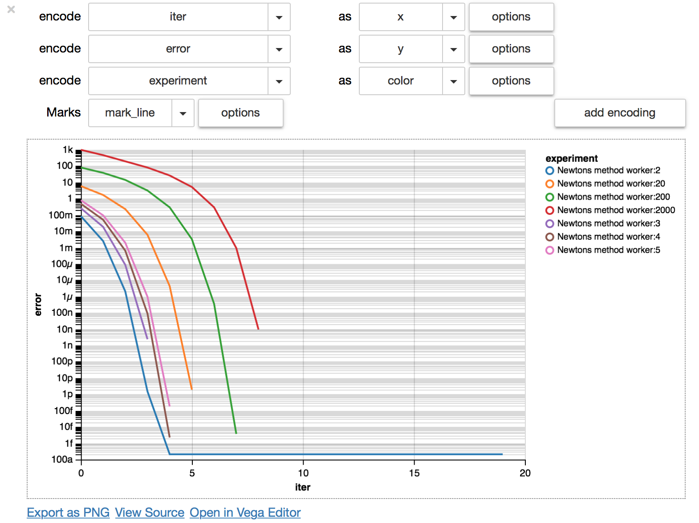

# Blackbox: A flight recorder for scientific programming!

Blackbox is a simple, yet powerful logging tool for scientific programming in python. With Blackbox you can focus on developing your algorithms, and easily compare different versions of them. Blackbox takes care of the data collection and lets you spend all your time on developing and fine tuning your algorithms. In addition Blackbox has low overhead - it will not steal awaya valuable compute resources from your code.

Blackbox is developed by [Lalit Jain](www.lalitjain.com) and [Scott Sievert](http://scottsievert.com/). 

## Documentation

~~You can find some documentation here.~~ (Still coming!)

## Example

```python
import math
import blackbox

@blackbox.record
def func():
	blackbox.log('var_in_func', 3)
	return 3
	
blackbox.set_experiment('ExampleExperiment')

blackbox.takeoff('Run 1')
blackbox.log('run_1_var', 1)
blackbox.save()
blackbox.land()

blackbox.takeoff('Run 2')
blackbox.log('run_2_var', 2)
func()
blackbox.save()
blackbox.land()

exp = blackbox.get_experiment('ExampleExperiment')
for run in exp.list_runs():
	print run.events
```

The output of the code is:

```python
Run 1 events
{'run_1_var': 1, 'timestamp': 1478988828.46922}

Run 2 events
{'timestamp': 1478988828.469392, 'run_2_var': 2}
{'var_in_func': 3, 'time_called': 1478988828.46943, 'timestamp': 1478988828.469438, 'function_call': 'func', 'time_ended': 1478988828.469433, 'result': 3, 'duration': 3.0994415283203125e-06, 'input': []}
```


## Installation
We recommend using blackbox in a `virtualenv`. You can install it as follows:
```python
python setup.py install
```


## Visualization
We provide an example visualization interface in `Visualization.ipynb`. We show
plotting tools in Altair, pandas and matplotlib.

In this, we can provide this data exploration tool in the Jupyter notebook.
This an interactive widget that allows you to easily visualize the plot.




## Notes:
These are mostly for the gratification of the developers - please do not read carefully or at all!

11/09/2016 - The interface of the Serializer is still not clear to me. I like it being stateless...but then, what's the point of putting it in a class? Even then, it's not actually stateless, because it needs to keep an open file pointer...can the serializer be a file object?
Related question - does the get_experiment belong in the serializer? Or maybe the right abstraction is a stateful serializer, and then class level routines for unserializing?

11/10/2016 - TODO: An experiment should know what Serializer was used to store it!

11/11/2016 - The winning Serializer is msgpack! It has crazy fast serialization and very low overhead over the process run time. I think all solutions moving forward should use it - unless it is an in-memory solution like Redis.

11/11/2016 - With the use of the MsgpackSerializer, you need to ensure that there is one run per process, and these runs have unique names. Otherwise, open file objects in different processes may overwrite each other. You also can't pass down any explicit information to the subprocesses - this would prevent the library from "just working TM".

There are many ways to get around this! Here are a couple:
1. Use a MongoSerializer or RedisSerializer that writes to a collection with same name as the run. You can sort by timestamp later.
2. Have one global thread that processes items from a multiprocessing(mp) queue. This is a very Unix based solution - the way multiprocessing works, any global queue is available to every child process. Each child process can push jobs on this queue, and then a thread on the main queue can maintain a collection of file streams that it writes the events too. Note that pickling and unpickling the objects on the queue (implicitly done by mp) is very expensive!
3. Have each process write to a different file - you can imagine using uuid's or something .... and then coalescing these items by timestamp later. This is probably the easiest solution.


There might be some more ideas [here](http://stackoverflow.com/questions/641420/how-should-i-log-while-using-multiprocessing-in-python). There seems to be a recommended solution using pipes. I am very curious about it! It might run into the same issues as I do (see cdleary's comment and in general that whole comment thread).
